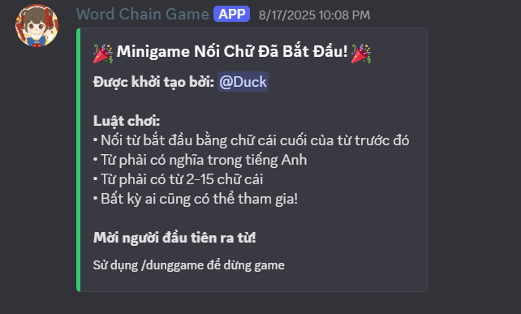

# 🎮 Word Chain Game Discord Bot

A Discord bot for the **English Word Chain** minigame!  
Challenge your friends, test your English vocabulary, and have fun right on your Discord server.
Note: If you want me to support English language, I can update immediately.

## 🚀 Features

- **English Word Chain**: Players must submit a word that starts with the last letter of the previous word.
- **Word Meaning Check**: Words must be valid English words (checked via dictionary API).
- **Automatic Game Management**: Start, stop, and check game status with slash commands.
- **Interactive Feedback**: Uses embeds, reactions, and clear notifications.

## 🛠️ Installation

1. **Clone the repository:**

   ```bash
   git clone https://github.com/Ocennami/Word-Chain-Game.git
   cd Word-Chain-Game
   ```

2. **Install Python & dependencies:**

   - Requires Python 3.8+
   - Install dependencies:
     ```bash
     pip install -r requirements.txt
     ```

3. **Create a `.env` file and add your bot token:**
   ```
   DISCORD_TOKEN=your_token_here
   ```

## ⚡ Usage

Run the bot:

```bash
python main.py
```

### Main Commands

- `/noichu` : Start the word chain minigame in the current channel.
- `/dunggame` : Stop the word chain minigame.
- `/checkgame` : Check the current game status.

**Game Rules:**

- Words must be valid English words.
- Words must be 2-15 letters long.
- The next word must start with the last letter of the previous word.
- Anyone can join at any time!

## 📦 Requirements

- Python 3.8+
- discord.py
- python-dotenv

## 📝 Example



## 🛡️ License

MIT License

---
